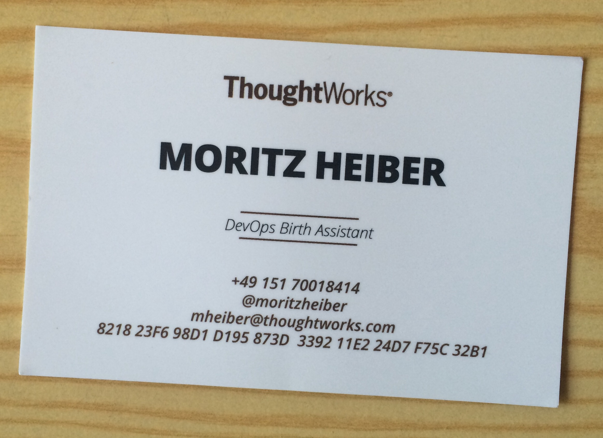
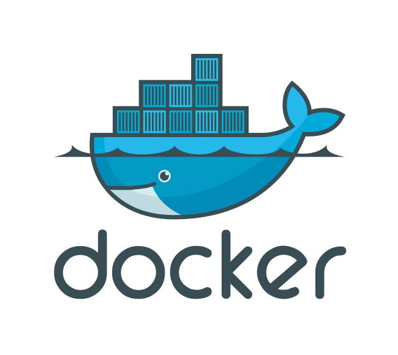

class: top, left, backgroundcolor
layout: true
count: false
background-size: contain

.footnote[]

---
background-image: url(images/port-authority.png)
class: middle

# Playing Port Authority
## TDD for containers

.footnote[.citation[CC-BY-2.0: https://www.flickr.com/photos/hamptonroadspartnership/]]

???

- Hello everyone, my name is Moritz Heiber, I'm going to be talking about building infrastructure today in the sense of playing Port Authority when using containers. Meaning, while you do build containers and load them with precious cargo (hint: your applications) you're also keeping a close eye on what's expected of these containers.
- You're essentially playing port authority.

---
class: center, middle, backgroundcolor
layout: true
count: false

.footnote[]

---
class: center

.image[

]

???

- This is my actual business card, I have them with me
- I call myself a "birth assistant", a birth assistant
  - If you didn't know, it is the male equivalent to a midwife
- And I call myself a birth assistant because that's why I usually do .. every larger (and sometimes smaller) software and/or hardware projects is precious to product managers, developers and engineers alike, and I help people bring their software and hardware babies into the world, using DevOps, Continuous Delivery, Microservices and some other buzzwords I forgot about right now

- But let's get to why we're here

---

???

- Who in here has used TDD before?

--

.image.smaller[

]

???

- TDD has become an essential technique for creating modern, reliable and resilient applications, especially when it comes to handy practices such as Continuous Delivery
- You write your (unit) test, you write your code, rinse and repeat, out comes your clearly modeled application code, fully verified to conform to your expectations, because you literally have written them, as code, before you wrote the actual application part which they refer to
- This has become such a well-established practice that it's the de-facto standard for whenever we are co- or full-delivering with our clients; and a lot of others are using it too, obviously

---

# ? ? ?

???

- So the question is: why aren't we using it for everything? Especially since other practices like Infrastructure as Code have been around now for a while
- Well, what if I told you this is exactly what we are doing, and what you can do, with a few small, incremental steps (agile joke!) TODAY using containers!

---

.image.larger[

]

---
class: center

.image[

]

???

- These days a lot of things (tm) are getting build using container technology. Docker is a prime contender on the market, a lot of people are using its versatility, portability and isolation to structure their applications, enable them to develop complex interconnected applications faster and deploy them with little effort. Docker, in a sense, is the manifestation of Infrastructure as Code, given that a Dockerfile is code and usually contains a set of instructions which provisions an environment meant for running software.

- However, as much as we usually follow TDD principles with regular software these days, when it comes to infrastructure and containers in particular many people usually have the approach of plug and pray (tm), whereas it seemingly is easier to just "try out some changes" and deal with the resulting Armageddon through rollbacks or other mitigations.

- While that might be appropriate for one developer hacking away on their laptop, once you actually have to write code for containers and your infrastructure in a team you will probably run into problems rather sooner than later with this "fire and forget" approach. At this point people usually establish environments where things are spun up on demand, tested for coherence and then propagated to production at a later point in time when seemingly stable enough.

- But what if we were to apply the same principles and methodologies we apply to our "regular" code to infrastructure and container code as well? What if you were to write unit, functional and integration tests **before** writing your infrastructure and container code? And could then verify immediately, by running your tests that you were on the right track? Sort of like "inspecting" your containers on the fly instead of just letting them past unchecked, loaded onto carriers and destined for uncharted waters?

---
class: top, left, backgroundcolor
layout: true
count: false
background-size: contain

.footnote[]

---

## Testing production code

```ruby
describe "fizzbuzz" do
  it 'returns "Fizz" when the number can be divided by 3' do
    fizz_3 = fizzbuzz(3)

    expect(fizz_3).to eq("Fizz")
  end
end
```

???

- This is how you would usually go about writing code that might (or might not) end up in production at a later point in time
- You write your test first, then you run it (and hopefully it'll return a red warning) and then you write the code to satisfy the test
- Small, incremental steps
- It's Red > Green > Refactor
- This is example in RSpec, a BDD framework for Ruby

---

## And testing infrastructure?

???

- What if you could test a container in the same way
- serverspec
  - based on rspec and specinfra
  - lightweight
- You can do TDD with this!

--

[embedmd]:# (spec/example1/example_spec.rb ruby /image =/ $)

???

- Complete test that checks whether ruby package is installed
- Lets look at some parts in more detail

---

## Step by step

--

[embedmd]:# (spec/example1/example_spec.rb ruby /image =/ /\)/)

???

- build the image using docker-api

--

[embedmd]:# (spec/example1/example_spec.rb ruby /.*set :docker.*/)

???

- tell serverspec which image to start

--

[embedmd]:# (spec/example1/example_spec.rb ruby /.*describe\ \'package\ ruby'.*/ /^....end\n..end/)

???

- the actual test

---

## Execute it!

```bash
$ bundle install --path vendor/bundle

$ bundle exec rspec spec/example1/example_spec.rb
```

???

- ruby bundler
- Run like any other rspec test
- **CHANGE THE BRANCH HERE**
- **RUN TEST1**

---

## Lets turn this test green!

--

[embedmd]:# (Dockerfile.example1 Dockerfile)

???

- Using Alpine as anything in a container should start with Alpine these days
  - Officially supported by Docker Inc.
  - It's just 2MB (!), has so many ready-to-use packages
  - Laziness comes at the cost of security and instability
- All it does is install the ruby package. DONE

---

## Project structure

```verbatim
├── Dockerfile.example1
├── Gemfile
├── Gemfile.lock
└── spec
    ├── example1
    │   └── example_spec.rb
    └── spec_helper.rb
```

???

- rspec expects a certain folder structure, pictured here

---

## Gemfile

[embedmd]:# (Gemfile ruby /.*/ /.*docker-api.*/)

???

- typical Gemfile, package definition for Bundler (Ruby package manager)

--

## spec\_helper.rb

[embedmd]:# (spec/spec_helper.rb ruby)

???

- Does what every example needs
- require gems
- Tell serverspec to use Docker as its backend
- Tell serverspec about the OS
  - Many other OS supported, including Windows (!)

- But let's move on to something that's a little more complicated

- **SWITCH BRANCH AND RUN TEST1**

---

## Step 2 - Simple Web Service

--

[embedmd]:# (sinatra_example.rb ruby)

???

- Simple web service using Sinatra (very small web framework for Ruby)
- Only echos "Simple Web Service"

---

## Test service in container

[embedmd]:# (spec/example2/example2_spec.rb ruby /describe.*/ $)

???

- **SWITCH BRANCH AND RUN TEST2**
- **SWITCH BACK TO MASTER**

---

## Again, make the test green

[embedmd]:# (Dockerfile.example2 Dockerfile)

???

- **RUN TEST2 AGAIN**

---

## Compose it!

--
### Web Service needs consul

[embedmd]:# (sinatra_example3.rb ruby)

???

- What if: testing in concert
- Assume sinatra web service consul
  - Get welcome message
---

### docker-compose.yml

[embedmd]:# (docker-compose.yml yml)

---

### Test it

--

[embedmd]:# (spec/example3/example3_spec.rb ruby /before.*/ /end/)

???

- setup code
- start all services

--

[embedmd]:# (spec/example3/example3_spec.rb ruby /after.*/ /end/)

???

- teardown
- and bring them down afterwards

--

[embedmd]:# (spec/example3/example3_spec.rb ruby /.*docker_container.*/)

???

- tell serverspec to use the container

---

### The complete test

[embedmd]:# (spec/example3/example3_spec.rb ruby /describe/ /true\)\n..end/)

---

### continued

[embedmd]:# (spec/example3/example3_spec.rb ruby /describe.*Consul Connection/ /end\nend/)

???

- **SWITCH BRANCH + RUN TEST**
- **SWITCH BACK**

---

## Dockerfile for connected Sinatra app

--

[embedmd]:# (Dockerfile.example3 dockerfile)

???

- **RUN TEST**

---
## Resource Types

```ruby
  describe file('/some/file') do
    it { should exist }
    its(:content) { should match(/something/) }
  end
```
--
- user
- group
- process
- port
- **x509\_certificate**
- **docker\_container/\_image**
- _many more_...

---
## Backends

--

### docker
### ssh
### exec
### winrm
### ...

???

- Many different backends

---
# Links

- **This presentation: [https://github.com/moritzheiber/playing-port-authority](https://github.com/moritzheiber/playing-port-authority)**

- **Serverspec: [http://serverspec.org/](http://serverspec.org/)**

- **Specinfra: [https://github.com/mizzy/specinfra](https://github.com/mizzy/specinfra)**

- **rspec-wait: [https://github.com/laserlemon/rspec-wait](https://github.com/laserlemon/rspec-wait)**

---
class: center, middle
background-image: url(images/containers.png)

.dark-bg[
# Thanks!
 @mheiber@toot.thoughtworks.com | <i class="fa fa-envelope"></i> mheiber@thoughtworks.com | <i class="fa fa-home"></i> heiber.im
]

.footnote[.citation[Scanrail - http://theloadstar.co.uk/container-shipping-rates-still-falling-forward-data-points-upward-trend/]]
